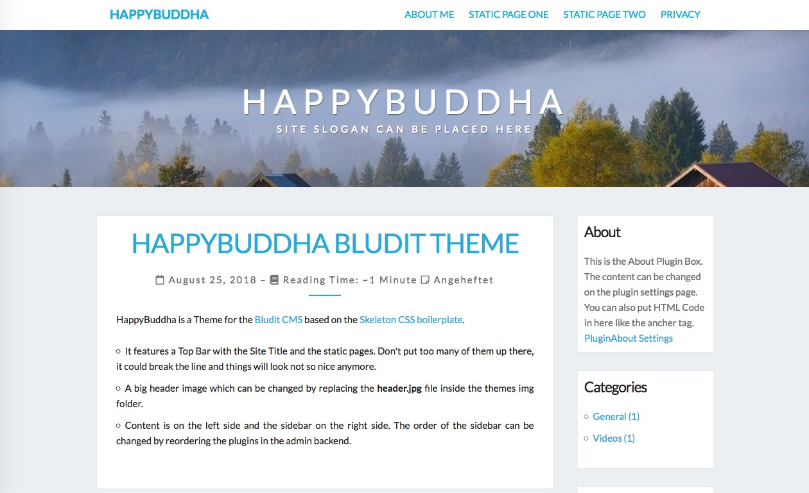

# HappyBuddha

This is a theme made for the [bludit] cms system by [Diego Najar][bludit]

This theme was made for a friend. Feel free to use it if you want. 

Thank you!

## General Information

This theme features a header line with the title of the page and
a listing of static pages. Don't create to many of them!

The header image can be changed in the **happy.css** file.

The main section contains the content on the left side and the sidebar
on the right side. The Sidebar contains the different blocks from different
active plugins. To change the order of the blocks, you need to change
the order of the plugins in the plugin configuration on the admin page. 

## Header Image

The header image is from pixabay. Sorry but I forgot the link to the
author. But it is mention free image. 

[bludit]:https://www.bludit.com

## Screenshot

